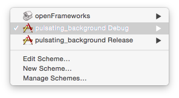

# ofEmergency

Trivial Pulsating Example written using openFrameworks. Project optimized for use on Apple OS X.

The instructions below assume you have the latest version os Xcode
installed.

Build Instructions:
- Open `pulsating_background.xcodeproj`.
- Ensure the build scheme is set to `pulsating_background Debug`.
  - 
- Build & Run the project.
